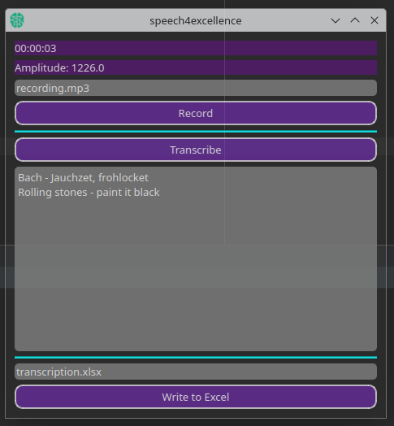

# speech4excellence

## tl;dr
Voice transcription prototype with openAI's Whisper and PyQt-UI and Excel output



## Introduction

**speech4excellence** stands as a homage to the untapped potential within your voice, transforming verbal gold into the
structured silver of Excel spreadsheets. Embark on a journey from spoken word to written excellence, where each
utterance finds its place in a cell, as meticulously organized as a librarian with OCD. In essence, **speech4excellence**
is not merely a program; it's a bridge between the fluidity of conversation and the rigidity of data analysis. Akin
to alchemy, but for the digital age.

## How does it look in action?
<video width="500" height="520" controls>
  <source src="recording.mp4" type="video/mp4">
  Your browser does not support the video tag.
</video>

## Features

- **Audio Recording**: Capture every nuance of your voice with crystal-clear digital recording.
- **Dynamic Amplitude Display**: Watch as your voice's power ebbs and flows in real time.
- **Transcription Service**: Utilize the prowess of OpenAI's Whisper model to transcribe audio to text.
- **Excel Integration**: Seamlessly export your transcribed text into Excel, where your words become data.

## Workflow

1. **Record**: Hit the 'Record' button and start speaking. Your voice is now being digitized.
2. **Transcribe**: With the power of OpenAI, your spoken words are meticulously transcribed into text.
3. **Export to Excel**: Witness as your words transcend the auditory realm, finding a new home within the structured
   confines of an Excel spreadsheet.

## Requirements

Ensure you have the following installed:

- Python 3.10 or newer
- PyQt5
- PyAudio
- Wave
- Audioop
- Pydub
- OpenAI's Python library
- Openpyxl

For the detailed list of dependencies, refer to the `requirements.txt` file. To install, run:

```bash
pip install -r requirements.txt
```

## Setup

Before using **speech4excellence**, ensure you have set the `OPENAI_API_KEY` environment variable to your OpenAI API
key. Without it, the program shall not pass (into the realm of functionality).

## Usage

Run the main program with:
```bash
python speech4excellence.py
```

Make sure your microphone is connected and properly configured. Your journey from speech to spreadsheet is about to
begin.

## License

**speech4excellence** is released under the GPL v3 license. Feel free to use, modify, and distribute, as long as you
keep the spirit of open source alive.

## Contact

For bugs, feature requests, or just to say hi, reach out to Marcel Petrick
at [mail@marcelpetrick.it](mailto:mail@marcelpetrick.it).

---

Remember, **speech4excellence** is not just about transcribing words; it's about charting the unexplored territories of
your Excel spreadsheets. Let your voice be the compass.  

Haha, thanks for reading until the last line. This is just a README file, not a novel. But I appreciate your dedication.

